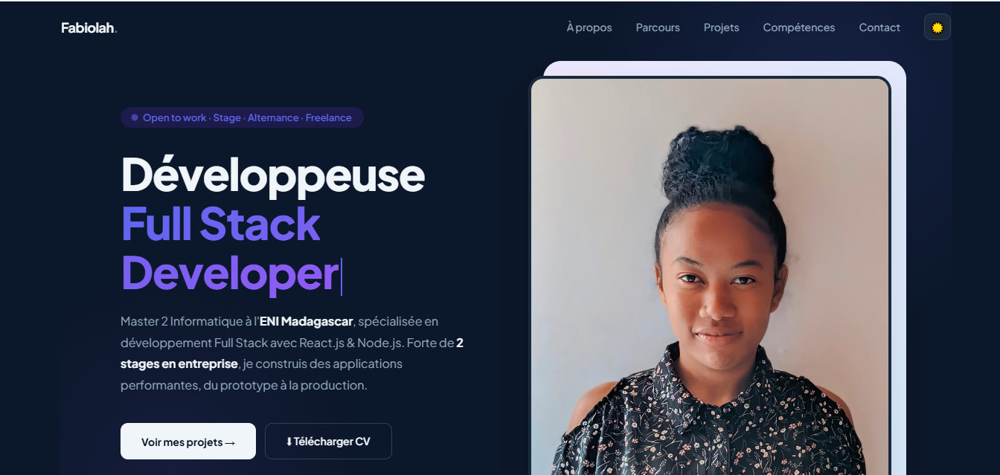

# Fabiolah ANDRIATAHINA — Portfolio

> Développeuse Full Stack · React.js & Node.js · Master 2 ENI Madagascar

[](https://portfolio-uf6p.vercel.app/)
[](https://reactjs.org/)
[](https://vercel.com/)

---

## 📸 Aperçu



---

## ✨ Fonctionnalités

- 🌙 **Dark / Light mode** — bascule en un clic avec transition fluide
- ✍️ **Typewriter animé** — rôles qui s'écrivent et s'effacent en boucle
- 🎠 **Carrousel de projets** — défilement automatique avec navigation manuelle
- 🎓 **Section Parcours** — timeline formation + expériences professionnelles
- 🖼️ **Logos tech officiels** — icônes colorées via Devicon CDN
- 📬 **Formulaire de contact** — intégration EmailJS, zéro backend
- 📱 **Responsive** — adapté mobile, tablette et desktop
- ♿ **SEO optimisé** — meta tags, Open Graph et Twitter Card

---

## 🛠️ Stack technique

| Catégorie     | Technologies                        |
|---------------|-------------------------------------|
| Frontend      | React.js, JavaScript ES6+, CSS-in-JS |
| Animations    | IntersectionObserver, CSS Keyframes  |
| Formulaire    | EmailJS                              |
| Déploiement   | Vercel (CI/CD automatique via GitHub)|
| Polices       | Plus Jakarta Sans (Google Fonts)     |

---

## 🚀 Lancer le projet en local

### Prérequis
- Node.js ≥ 16
- npm ou yarn

### Installation

```bash
# Cloner le repo
git clone https://github.com/andriatahinaFabiolah/portfolio.git
cd portfolio

# Installer les dépendances
npm install
```

### Variables d'environnement

Crée un fichier `.env` à la racine avec tes clés EmailJS :

```env
REACT_APP_EMAILJS_SERVICE_ID=your_service_id
REACT_APP_EMAILJS_TEMPLATE_ID=your_template_id
REACT_APP_EMAILJS_PUBLIC_KEY=your_public_key
```

### Démarrer

```bash
npm start
```

Le site sera disponible sur [http://localhost:3000](http://localhost:3000)

---

## 📁 Structure du projet

```
src/
├── App.js                  # Point d'entrée
├── components/             # Composants React
│   ├── Navbar.jsx
│   ├── Hero.jsx
│   ├── Parcours.jsx
│   ├── Projects.jsx
│   ├── Skills.jsx
│   ├── Contact.jsx
│   ├── Footer.jsx
│   └── Reveal.jsx
├── data/                   # Données statiques
│   ├── projects.js
│   ├── skills.js
│   └── parcours.js
└── hooks/                  # Custom hooks
    ├── useVisible.js
    └── useTypewriter.js
```

---

## 👩‍💻 Auteure

**ANDRIATAHINA Vonjihery Fabiolah**

[](mailto:andriatahinafabiolah@gmail.com)
[](https://github.com/andriatahinaFabiolah)
[](https://portfolio-uf6p.vercel.app/)

---

*Master 2 Informatique · École Nationale d'Informatique (ENI) · Madagascar*

